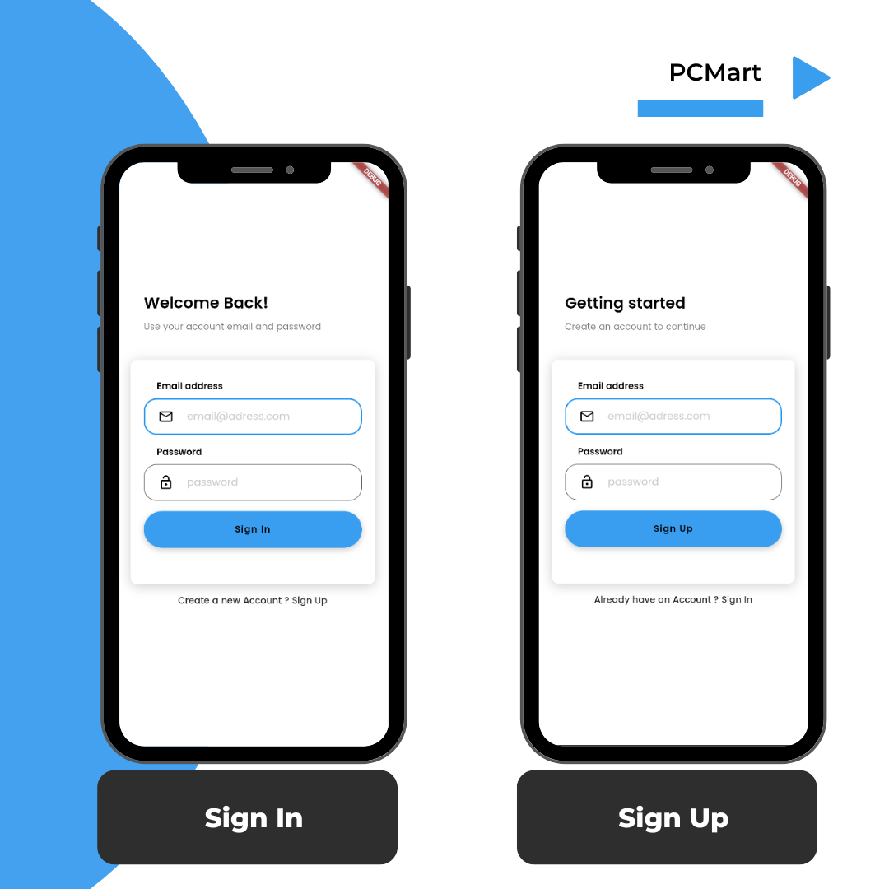
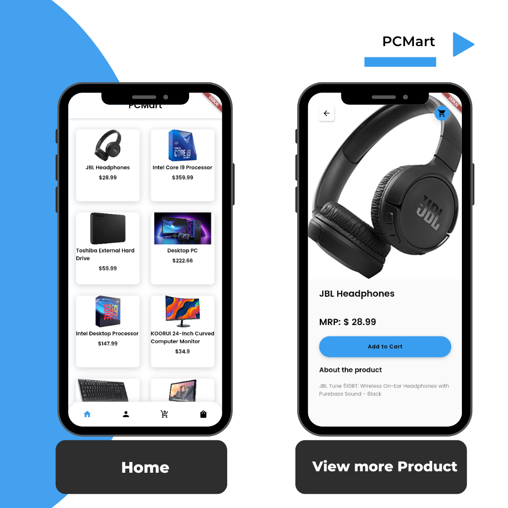
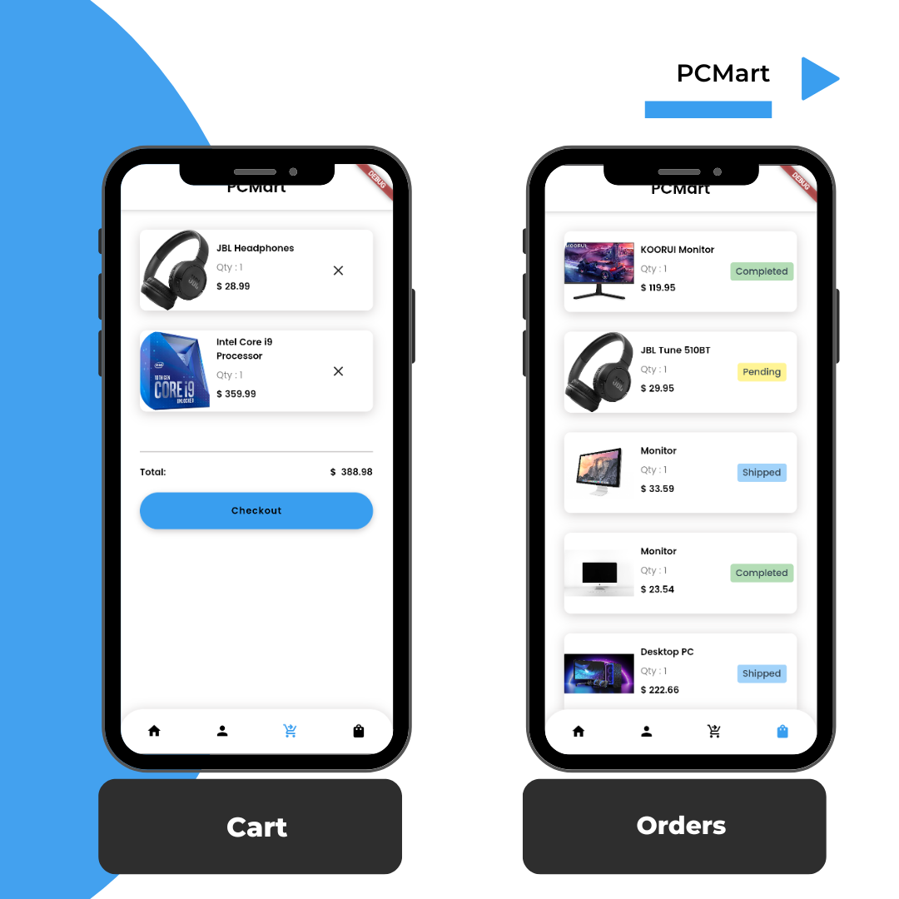
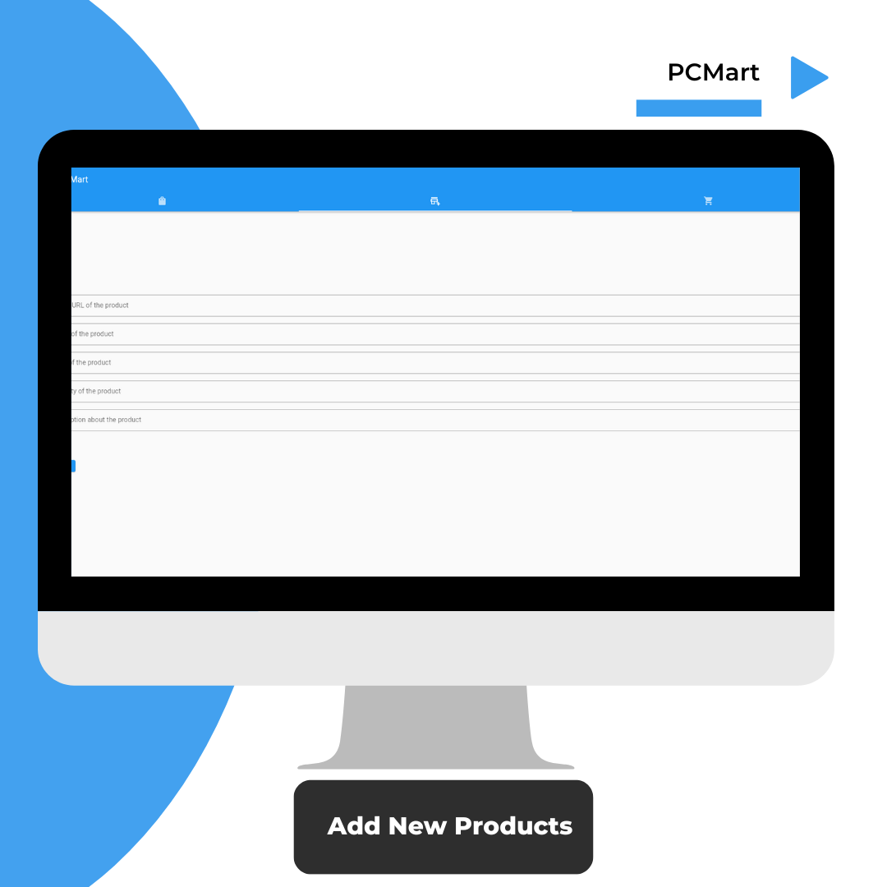
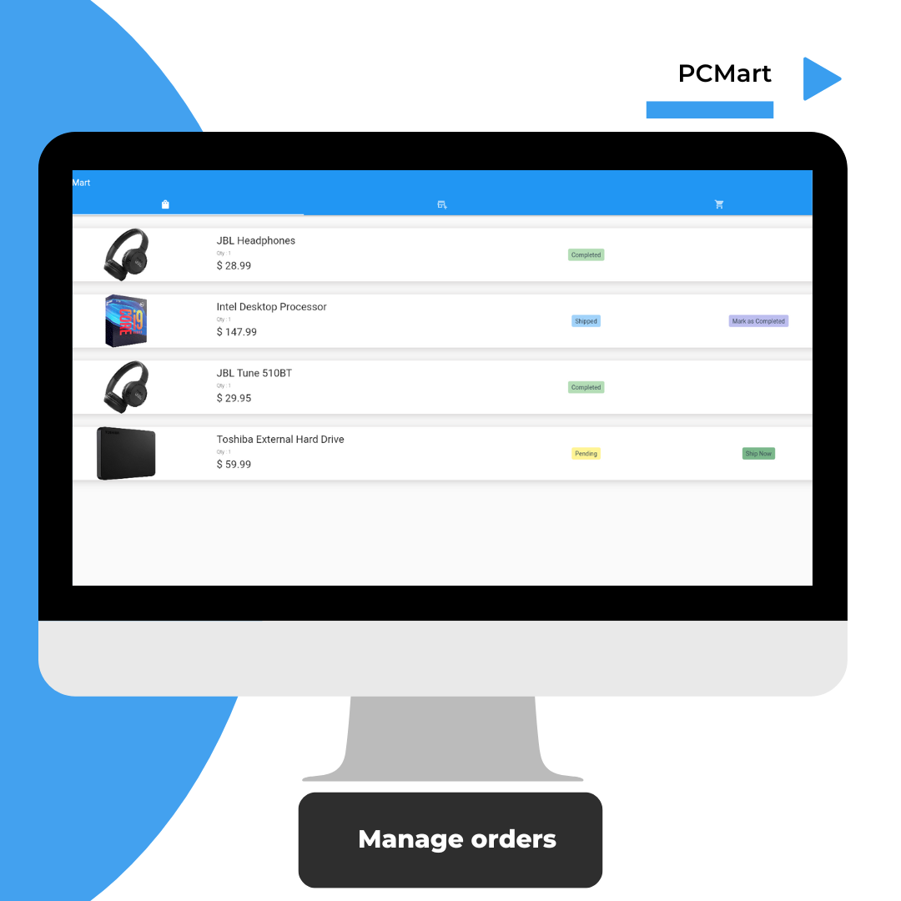
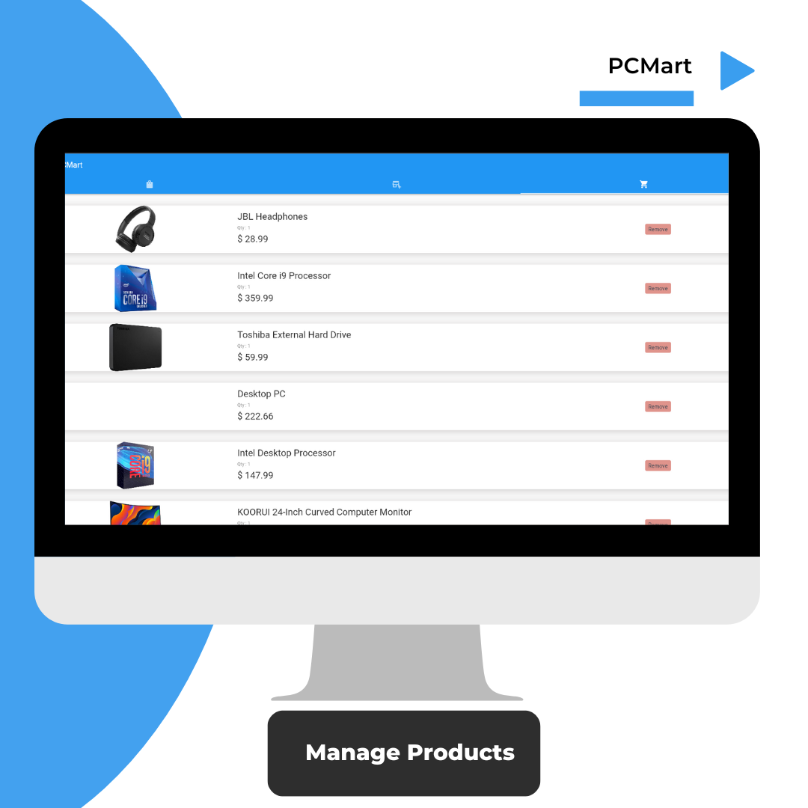

# "PCMart" - A simple  e-commerce flutter app for computer accessories

## Technologies
- Flutter
- Dart
- Firebase

## Subsystems
- Authentication (Signin/signup/signout)
- Buy selected products
- Product Management
- Orders Handling

## Users
- Customers
- Admin (owner)

## Product Features
- Allow customers to add selected products to a cart.
- Manage products based on availability.
- Handle orders placed by customers.
- Calculate total payments should be pay based on products added to the cart.
- Allow customers to remove items from the cart.
- Customers able view status of their currrent oders and able view all the orders they have placed.

## Screen Captures

## Customer

## Owner

